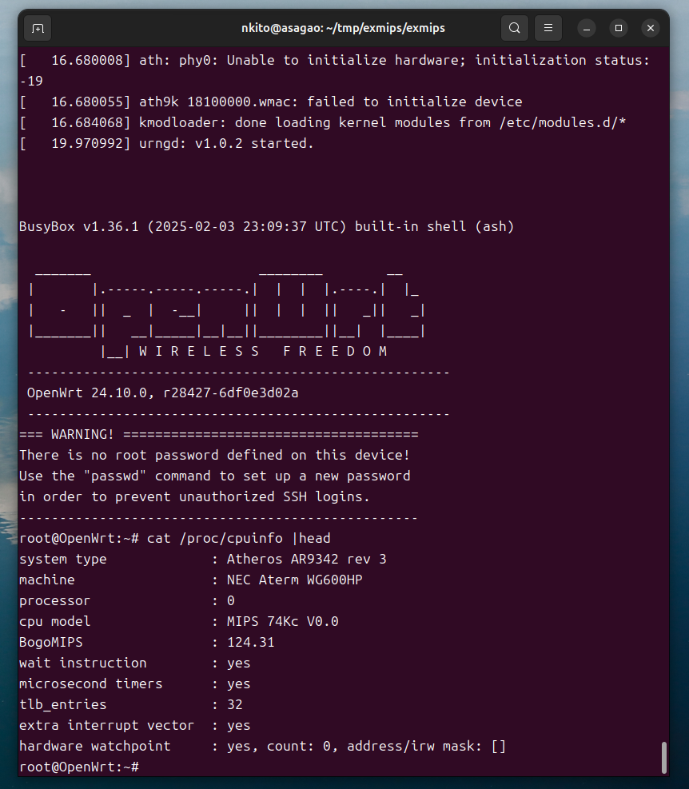

# MIPS Emulator

## Overview

This emulator emulates Atheros AR934x SoC including a processor core of MIPS32R2. The SoC has been used in home routers.
It is capable to run [OpenWRT](https://openwrt.org/ "OpenWrt Wiki"), a well-known Linux distribution for home routers.



This emulator has runtime binary translation, i.e., translating a MIPS32R2 instruction into x64 instructions during emulation, 
to improve execution speed. This functionarity works only in x64 processors.
The runtime binary translation is enabled by default and can be disabled by options in src/config.h.

Most of functionalities to run Linux including an Ethernet controller is implemented in this emulator.
However, the following features of the SoC are not included.
- Audio interface
- DRAM controller interface
- Ethernet switch
- Internal SRAM
- PCIe interface
- USB interface
- Wireless interface

And, some functionalities of cache instruction are not implemented because cache memory is not emulated.
Especially, it is not possible to run tricky codes such like codes using cache memory as a memory outside of the DRAM address region 
by locking cache lines with cache instruction.

## Build

### Emulator

Some parameters such as DRAM capacity are determined in compilation time.
Skilled users could change the parameters defined in src/config.h before compilation.

```
$ make 
```

### Flash memory image (consisting of U-Boot and OpenWrt)

A flash-memory image file is necessary to use the emulator.
This section describes the build process of the bootloader U-Boot and a flash memory image consisting of the U-Boot and an official OpenWrt image.
Some prebuild flash-memory image files are in [this repository](https://github.com/nkito/exmips_images "Image files for MIPS32R2 emulator").
If customization is unnecessary, using a prebuilt image is an easy way.

The U-Boot for the emulator is obtained with modifying [the U-Boot code for NEC Aterm WG600HP router](https://github.com/musashino-build/u-boot.git "U-Boot").
The low level initialization of hardware, such as initialization of a DRAM controller, is not necessary for the emulator and unsupported.
A patch disables the initialization process.
The build process and generation of the flash-memory image are automated with u-boot/build_uboot.sh as follows.
Some developper tools, such as bison, flex, libssl-dev, and gcc-mips-linux-gnu, are necessary to build the U-Boot with the script.

```
$ cd u-boot
$ bash build_uboot.sh
```
The resultant flash-memory images are ``firm_u-boot_initramfs.bin`` and ``firm_u-boot_squashfs.bin``. 
The former one is a read-only image. The file system is formed in DRAM.
The latter one uses the flash memory as a storage device. It is possible to save modifications for the file system.

## Usage

### Basic

The emulator works using a flash-memory image. 

```
$ ./exmips u-boot/firm_u-boot_initramfs.bin
```

Twice inputs of Ctrl+C enter "emulator monitor". Please enter "halt" command in the monitor to halt the emulator.

The emulator loads the flash-memory image before starting the emulation.
The image file will not be modified by default even if the flash is modified in emulator.
The emulation with option ``-s``, as following, enables write-back of the flash-memory image into the image file when the simulator halts.

```
$ ./exmips -s u-boot/firm_u-boot_squashfs.bin
```

### With large flash memory

The emulator simulates 64Mbit (8MBytes) Spansion S25Fl164K SPI flash memory by default.
It also support 2Gbit (256MBytes) Macronix MX66U2G45G SPI flash memory and the 2Gbit flash is selected when "-f 256" option is used.

The kernel image contains a layout of a flash memory device as a device tree. 
A modification of the device tree file and a recompile are necessary to use the whole of a 2Gbit flash memory device.


### Networking

The supprt of an ethernet controller uses TUN/TAP interface.
If network connectivity is necessary, running the emulator in a container environment is recommended because the setting of the TUN/TAP interface is complicated.
Dockerfile and scripts to invoke a container in Ubuntu and Windows WSL environments are available in docker folder.
